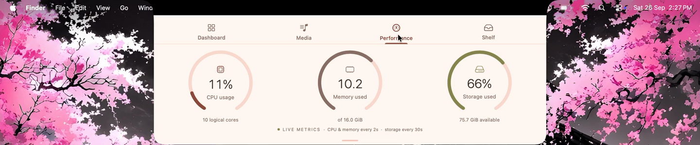

# Caelestia Notch

A native macOS notch companion inspired by **Caelestia Shell**: warm cream,
peach cards, terracotta accents, circular music visualization, and Bongo Cat.
Built for your M4 Mac with SwiftUI + AppKit. Requires **macOS 14+ and Xcode 16+**.
No Homebrew, API keys, Swift packages, or paid developer account needed to run locally.

## Product preview

<p align="center">
  <a href="demo/demo.mp4">
    
  </a>
</p>

<p align="center">
  <sub>▶ <a href="demo/demo.mp4">Watch the 24-second demo</a> — hover to expand, switch tabs, play music, drop files.</sub>
</p>

## Open and run in Xcode

1. Quit **Boring Notch** first so the two notch windows do not overlap.
2. Open **`CaelestiaNotch.xcodeproj`** from this folder. Open the project, not
    `Package.swift` (the package is for Core tests, not the app).
3. In Xcode's top toolbar, choose **CaelestiaNotch → My Mac**.
4. Press **⌘R** or click the triangular Run button.
5. Move your pointer to the top-center camera notch. The panel expands on hover
   and closes about half a second after your pointer leaves.

This is a menu-bar app: **there is no Dock icon or normal app window**. Find the
moon-and-stars icon in your menu bar for **Show Notch**, permissions, audio controls,
credits, and Quit. On a monitor without a notch, it creates a compact top-center strip.

### Connect Spotify

1. Open the **Spotify desktop app** and play a song.
2. Allow the macOS prompt that lets **Caelestia Notch control Spotify**.
3. Open the Media tab. Artwork, metadata, transport, and the seek slider use your
   installed Spotify app directly; there is no Spotify login inside this app.

If you denied access, go to **System Settings → Privacy & Security → Automation**,
enable Spotify under Caelestia Notch, then use **Retry Spotify Connection** in the
menu bar. The player also shows a Settings/Retry action when denied.

### Enable the real music visualizer

1. In Media, click **Enable visualizer**.
2. Allow **Screen & System Audio Recording** access when macOS asks. The exact
   category wording depends on your macOS version.
3. If macOS requests a restart, quit and reopen the **same app copy**, then click
   **Enable visualizer** again. Permission approval and starting capture are separate.
   You can also use the menu-bar **Audio Capture Settings…** shortcut.

### Permission is enabled, but capture still fails

Debug and Release now have separate privacy identities:
- **Caelestia Notch** — standalone Release app, `dev.personal.caelestianotch`.
- **Caelestia Notch Debug** — Xcode Debug app, `dev.personal.caelestianotch.debug`.

The original build used the same ID for both, causing macOS to associate permission
with a different local signature. A Settings toggle could appear enabled while
capture was rejected. To recover an old entry:

1. Quit all copies of the app.
2. In **System Settings → Privacy & Security → Screen & System Audio Recording**,
   remove the old Caelestia entry using **−**, then use **+** to add the exact app
   you want to run. Choose **Screen & System Audio Recording**, not audio-only;
   this ScreenCaptureKit implementation needs the screen-capture permission.
3. Select the app you built in Xcode or copied into **Applications**. Use the
   menu-bar **Show Running App in Finder** action to locate the exact running copy.
4. Open that same app, play Spotify, and click **Enable visualizer** again.

The menu's **Show Running App in Finder** reveals the exact copy. If capture fails,
**Details** in the Media footer displays the underlying error, build name, and path.
An ad-hoc-signed binary can still require reapproval after rebuilding that same
configuration; using a development signing certificate makes identity more stable.

The visualizer uses **actual system audio**, analyzed with a 2,048-sample FFT and
64 logarithmic frequency bands. Other apps' sounds can affect the bars. It does
not access your microphone, save audio, upload audio, or process screen images.
The OS may show a recording indicator while capture is enabled.

Audio capture is opt-in each launch. Disable it at any time from the menu bar.
The spectrum settles to zero on silence. The ring and Bongo Cat pause with Spotify.

### Beat-reactive Bongo Cat

The cat switches between the GIF's two poses on detected bass/drum pulses, with
a small, eased settling movement. It holds still between hits instead of looping
the original ten pose changes per second. A 320 ms cooldown caps tapping at about
three times per second. Both tabs share the same pose and beat detection.

Enable the audio visualizer for this behavior. Silence, paused Spotify, and capture
being off keep the cat still. Detection follows low-frequency pulses in system
audio, not an exact BPM grid; other apps' sounds can also trigger it while Spotify
is playing. Reduce Motion disables the extra compression/settle effect.

### Single-line lyrics

The Media tab shows **one synchronized lyric line below the song information and
above the playback controls**. It follows Spotify's position, holds while paused,
and updates when you seek. Long lines shrink slightly, then truncate to stay on
one line; hover the text to read the complete line.

Lyrics come from **[LRCLIB](https://lrclib.net)**, using the current track's title,
artist, album, and duration. Those details are sent to LRCLIB over HTTPS; no Spotify
credentials or audio are sent. This uses the same general lookup/timing approach
as Boring Notch's development branch. Audio capture can stay off for lyrics.

Songs without matching timestamped lyrics show **Synced lyrics unavailable**.
Instrumentals are labeled; intros and timestamped gaps show a music note. A failed
network lookup has an inline **Retry** action. Results are cached in memory for
up to 100 track/version combinations. Coverage and timing depend on LRCLIB's data.

### Temporary file Shelf

Drag local files or folders from Finder onto the notch to open **Shelf**. Drop
them into the **File tray** on the right, then drag a tile into Telegram, Finder,
or another app that accepts files. The **+** button also lets you choose files.
Drop files onto **AirDrop** on the left to open the native recipient chooser;
clicking that area lets you choose files first.

The tray holds references for this session only. It clears on quit; **Remove** and
**Clear** never delete originals. Outgoing drags are copy-only. Keep originals in
place—if one moves or disappears, add it again. This accepts existing local file
URLs, not text, web links, or promised downloads from other apps.

## What's included

| Tab | Features |
| --- | --- |
| Dashboard | Clock, current-month calendar, battery/charging, hardware model, uptime, mini Spotify player |
| Media | Circular album art, live radial frequency bars, title/artist/album, synchronized lyric line, previous/play/pause/next, seeking, beat-reactive Bongo Cat |
| Performance | CPU utilization, memory-used estimate, used/available disk space |
| Shelf | AirDrop recipient chooser, temporary file tray, native file drag-in/drag-out |

The selected tab is remembered. The panel follows display configuration changes
and prefers the display with a physical notch. The collapsed notch shows artwork
and a tiny live spectrum when capture is enabled.

Memory is an estimate from active, wired, compressed, and purgeable pages; it is
not Apple's memory-pressure score. Storage uses filesystem free capacity, so it
can differ from the purgeable-inclusive number in System Settings. CPU/memory
update every two seconds; disk/battery every thirty seconds. No temperatures,
weather, GPU gauge, workspace tab, or automatic launch at login in this version.

## Build a standalone app in Xcode

1. Open **`CaelestiaNotch.xcodeproj`** and select **CaelestiaNotch → My Mac**.
2. With Xcode active, click **Product** in the macOS menu bar at the very top of
   your screen, then choose **Scheme → Edit Scheme…**.
3. Select **Run** on the left, open the **Info** tab, and set **Build Configuration**
   to **Release**.
4. Click **Close**, then press **⌘R** to build and launch the optimized app.
   To build without launching, press **⌘B** instead.
5. In Xcode's project navigator on the left, expand **Products**, right-click
   **Caelestia Notch.app**, and select **Show in Finder**. If the app is running,
   its menu-bar **Show Running App in Finder** action also reveals the built app.
6. Quit the running app, copy **Caelestia Notch.app** into **Applications**, and
   open that copy. You can now use it without Xcode.

Xcode normally stores builds in **DerivedData**; use **Show in Finder** to locate
the exact build. After future rebuilds, replace the copy in Applications to update
it. Run one copy at a time and grant permissions to the copy you intend to use.

### Signing

The project uses **Sign to Run Locally** (ad-hoc signing), with the Apple Events
entitlement and no App Sandbox. A paid Apple developer subscription is unnecessary
for this local build. If Xcode asks for signing, select the project → CaelestiaNotch
target → Signing & Capabilities → **Signing Certificate: Sign to Run Locally**.
For more stable identity across builds, you can instead enable automatic signing
and select your own team. Local rebuilds may require permission approval again.
This project is not configured for App Store distribution or notarization.

## Where to customize

```text
CaelestiaNotch/
  App/          App lifecycle, shared state, menu-bar controls
  Window/       Notch positioning, hover detection, collapse delay
  Services/     Spotify, lyrics, ScreenCaptureKit audio, cat motion, system metrics
  Core/         FFT, beat detection, lyric parsing/lookup, playback clock
  UI/           Theme, four tabs, native file dragging, circular visualizer, GIF renderer
  Resources/    Bongo Cat GIF and upstream attribution/license
Config/         Info.plist, Apple Events entitlement
Tests/          Audio-analysis tests
```

- **Colors:** `UI/Theme.swift` → `Palette`.
- **Size and hover delay:** `Window/NotchWindowController.swift`.
- **Tab layouts:** `UI/DashboardView.swift`, `MediaView.swift`, `PerformanceView.swift`.
- **Visualizer response:** `Core/SpectrumAnalyzer.swift`.
- **Cat sensitivity/cooldown:** `Core/BeatDetector.swift`; settling effect in `UI/BongoCatView.swift`.
- **Lyrics:** `UI/LyricLineView.swift`, `Services/LyricsService.swift`, and `Core/LRCLIBClient.swift`.

Bongo Cat is the character in the linked Caelestia GIF (rather than Kirby).
The bundled GIF is unmodified; upstream source and GPL license are included in
`CaelestiaNotch/Resources/`. This is an unofficial app inspired by Caelestia Shell.
